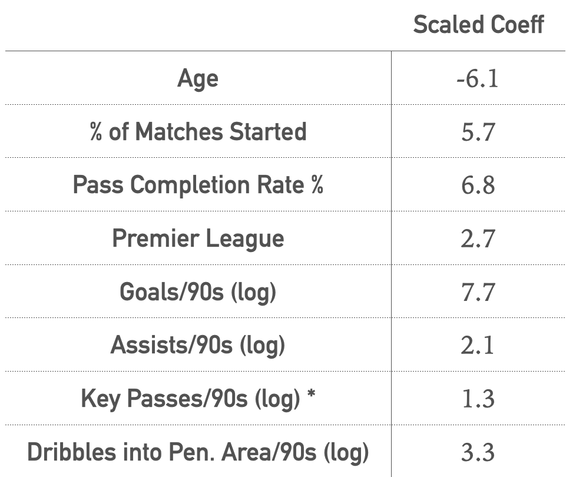

# Predicting Soccer Players' Transfer Market Values Using Linear Regression

### Overview

**Goal:** Build a linear regression model that can predict a soccer player’s transfer market value based on his stats.

**Questions to answer:** 

- Which statistics affect a player’s transfer value the most?
- Can the model be used to help European soccer clubs with their scouting and transfer negotiation process (e.g., finding undervalued players)?

### Data and Tools 

- Data: Scraped player stats from FBref.com and player transfer market values from transfermarkt.us. I made the assumption that players need multiple seasons of consistent performance to prove their worth in the transfer market so I used player stats over the last three and a half seasons.  I focused on the big 5 European leagues - Premier League, La Liga, Serie A, Bundesliga, and Ligue 1, as they are the closest in terms of the level of competitiveness and transfer market activity.  Finally, I narrowed down to just forwards and midfielders because defenders and goalkeepers are judged on completely different attributes (e.g., blocks and tackles for defenders).  That left me with about 1000 players without missing data.
- Tools used: Numpy, Pandas, Seaborn, Matplotlib, Beautiful Soup, Statsmodels and Scikit-learn.

### Feature Engineering and Selection

- Standardizing numerical stats: Injuries, youth promotions to senior squads, and player transfers from leagues outside of the Big 5 meant many players had fewer than three seasons of stats recorded. Therefore, I decided to standardize the numerical stats by dividing them by 90 minute games played.

- Log transformation of right-skewed features: Many of the features had right-skewed distribution, which makes sense because there is a much smaller number of star performers than under-performers in each league.

- Feature selection through Lasso coefficients: Eliminated features with high multi-collinearity and low correlation with the target variable

- Chose Ridge model through K-fold cross-validation. CV Adjusted R^2 of 0.63 and RMSE of 6.33.

- Final features: Age, % of Matches Started, Pass Completion Rate %, Premier League (dummy), Goals/90s (log), Assists/90s (log), Key Passes/90s (log), Dribbles into Penalty Area/90s (log). Target variable: Player market value ($MM)

### Results

- Ridge Test Adjusted R^2": 0.63 (slight overfitting), RMSE: 6.52, MAE: 5.03

- I **unscaled** the Ridge coefficients to assess the dollar impact of changing each player stat. For example, everything else being constant, a player would lose $1.7 million of market value on average every year as he gets older, which we know is not true in many cases so this model isn’t perfect.  Also, a player’s value would go up by a million $ for a percentage point increase in pass completion rate, so for instance from 80% to 81%.  With log transformed features, we can interpret it as, for every 1% increase in, let’s say goals scored per 90 min games played, a player’s market value goes up by $570k.

- In order to compare the relative importance of the player stats, I went back to **scaled** coefficients. Somewhat expectedly, stats that have higher influence on a team’s likelihood of winning games have greater impact on player transfer market values, like goals scored and dribbles into penalty area, which often lead to goals or assists. 

- What surprised me was that pass completion rate ranked towards the top, because a player can simply achieve high pass completion rate by making short sideway passes or back passes to defenders, and therefore is not reflective of high skills and don’t equate to high goal-scoring chances.  So if I were sitting down with someone from a scouting team, I would tell him to dig deeper into players with high pass completion rate and avoid them if only a few of them are chance creating passes. 

- Then lastly, the fact that playing in a premier league improves player value by about $6 million on average makes sense as it is the most scouted league in the world and the high commercial values for the premier league teams trickle down to the players as well.  But that doesn’t mean they have more skills or score more goals than those in the other big 5 leagues.  So perhaps scouting teams can find cheaper players in those leagues than the premier league with similar ability and talent.  

- For % of matches started, my model would indicate that those who start games less, or substitute players are valued lower, but again, often what matters is how well you perform in those 20 or 30 minutes you get subbed on for, and again you maybe able to find undervalued players who have a great goal and assist efficiency.

- **Further plots and results can be found in the [project presentation](Presentation/Metis_project2_PPT_vF.pdf). The main project code can by found in the three Jupyter notebook files located [here](Notebooks).**

